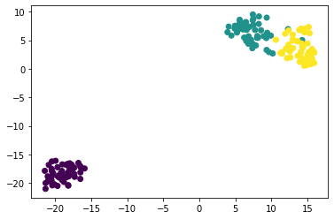

## Visualizing with hierarchical clustering and t-SNE

Hierarchical clustering is about breaking categories or clusters into broader
and broader categories in a hierachical fashion. We can extract information
from these hierarchies and they can be useful in understanding how clusters
behave in relation to one another.

There are two types of methods in hierarchical clusering:
- `agglomarotive clusering` which means going bottom-up
- `divisive clusering` which means going top-down

An effective way of visualizing hierarchical clustering is using dendrogams

#### Getting started

We will be using scipy to get the dendrogram working


```
from scipy.cluster.hierarchy import linkage, dendrogram

mergings = linkage(samples, method='complete')
dendrogram(mergings, labels=varieties,
           leaf_rotation=90, leaf_font_size=6)
plt.show()
```

So the linkage basically does a clustering behind the scenes aswell as linking
the clusters together.  The dendrogram is a bolt on for matplotlib for
visualizing the sucker.

Now we can move up and down our hierarchy using fcluster after builing the
linkage mergings.  This can be done with the fcluster function and we can
specify a height of 15:

```python
from scipy.cluster.hierarchy import fcluster
labels = fcluster(mergings, 15, criterion='distance')
```

Linkage types decide how the clusters will connect to one another.  Notably:
- In complete linkage, the distance between clusters is the ditance between the
  furthest points of the clusters
- In single linkage, the distance between clusters is teh distance between the
  closest points of the clusters

### Dimenstionality reduction with t-SNE

t-SNE will bring data in a clustering fashion down to lower dimensions which
can be really helpful for looking at our data.  It is embedded in sklearn, but
it only has the `.fit_transform()` method, so it both fits and transforms our
data at the same time.

Note that TSNE has some heurestics:
- It needs to be redone each time it is done
- It needs a learning rate (usually between 50-200 works), needs
  experimentation
- TSNE is different every time!

Lets see it in action:

```python
from sklearn.manifold import TSNE
model = TSNE(learning_rate=200)
tsne_features = model.fit_transform(samples)
xs = tsne_features[:,0]
ys = tsne_features[:,1]
plt.scatter(xs,ys,c=variety_numbers)
plt.show()
```


